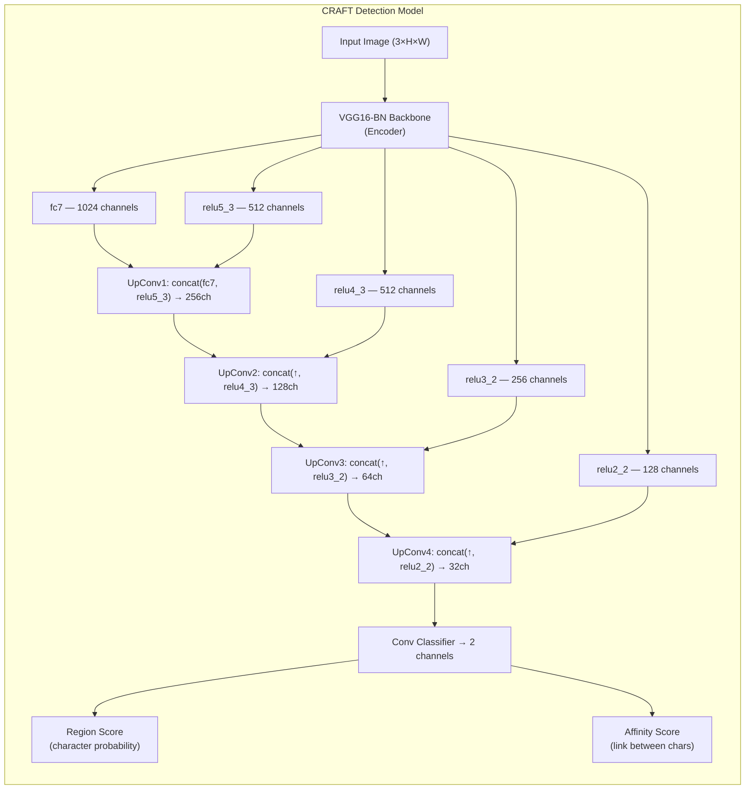
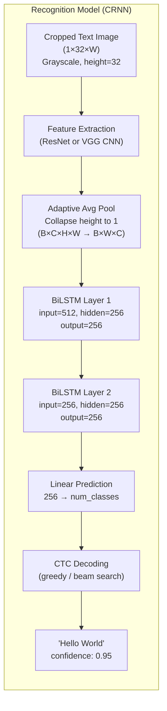
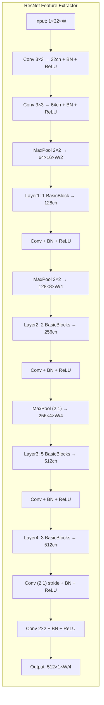
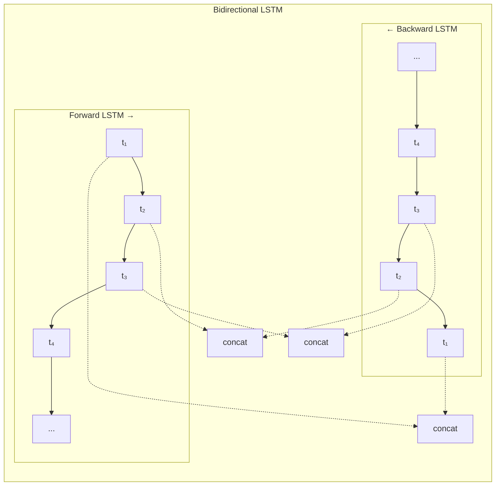
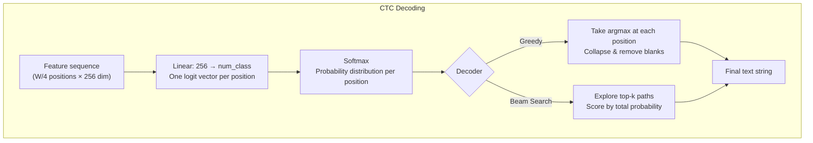
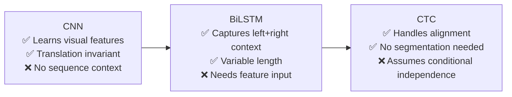

# EasyOCR Architecture — From Simple to Exact

---

## 0. First Things First — Every Complex Term, Explained Simply

Before we dive into the architecture, let's make sure you understand every term you'll encounter. Read this section first. Come back to it whenever you hit a word you don't recognize.

---

### 🧠 Neural Network Basics

| Term | Plain English |
|------|--------------|
| **Neural Network** | A program that learns patterns from data. It's made of layers of simple math operations stacked on top of each other. Each layer transforms the data a little more until the final answer comes out. |
| **Layer** | One step in the network. Takes some numbers in, does math, sends numbers out. Like one worker on an assembly line. |
| **Weights / Parameters** | The adjustable knobs inside the network. During training, the network tunes these knobs to get better at its task. Think of them as the "memory" of what the network has learned. |
| **Training** | The process of showing the network thousands of examples (images + correct answers) so it can adjust its weights. Like a student doing practice problems until they learn the pattern. |
| **Inference** | Using the trained network on new, unseen data. This is what happens when you run EasyOCR on your image. |
| **Pre-trained** | A model that someone else already trained on a large dataset. EasyOCR uses pre-trained models so you don't have to train from scratch. |
| **Batch** | A group of inputs processed together for efficiency. Instead of feeding one image at a time, you feed 16 or 32 at once. |

---

### 📐 Tensor & Shape Notation

| Term | Plain English |
|------|--------------|
| **Tensor** | Just a multi-dimensional array of numbers. A single number is a 0D tensor. A list `[1, 2, 3]` is a 1D tensor. A table/grid is 2D. An image (height × width × color) is 3D. A batch of images is 4D. |
| **Shape notation: `B × C × H × W`** | A standard way to describe tensor dimensions. **B** = Batch size (how many images), **C** = Channels (e.g., 3 for RGB color), **H** = Height in pixels, **W** = Width in pixels. So `(4 × 3 × 32 × 100)` means "4 images, each with 3 color channels, 32 pixels tall, 100 pixels wide." |
| **Channels** | For an input image: Red, Green, Blue = 3 channels. For a grayscale image: 1 channel. Inside a neural network, channels become abstract "feature detectors" — one channel might detect edges, another might detect curves, etc. The deeper you go, the more channels there are (32 → 64 → 128 → 256 → 512). |
| **Feature Map** | The output of a convolutional layer. It's a grid (like an image) but instead of colors, each "pixel" contains a number saying "how strongly did I detect feature X here?" If you have 128 channels, you have 128 such grids stacked together. |

---

### 🔲 Convolution (Conv)

| Term | Plain English |
|------|--------------|
| **Convolution (Conv)** | The fundamental operation of a CNN. Imagine a small magnifying glass (say 3×3 pixels) sliding across the image. At each position, it multiplies the pixels underneath by its learned weights, sums them up, and writes one number to the output. This magnifying glass is called a **kernel** or **filter**. |
| **Kernel / Filter** | The small sliding window in a convolution. A 3×3 kernel looks at 3×3 pixels at a time. The kernel's weights are *learned* — during training, it discovers what to look for (edges, curves, dots, etc.). |
| **Stride** | How many pixels the kernel jumps each step. Stride 1 = slide one pixel at a time (output same size). Stride 2 = skip every other pixel (output half the size). |
| **Padding** | Adding zeros around the border of the image so the kernel can process edge pixels properly. Without padding, the output shrinks slightly. |
| **Conv 3×3** | A convolution with a 3×3 pixel kernel. Most common size in deep learning. |
| **Conv 1×1** | A convolution with a 1×1 pixel kernel. Doesn't look at neighbors — just transforms each pixel's channels. Used to change the number of channels (e.g., 512 → 256). |
| **Conv (2,1)** | A convolution where the kernel/stride is 2 in height but 1 in width. Shrinks the image vertically but not horizontally. Important for text because text is wider than it is tall. |

---

### 📉 Pooling

| Term | Plain English |
|------|--------------|
| **Pooling** | Shrinking the feature map by summarizing small regions. Makes the network faster and helps it focus on "what" rather than "exactly where." |
| **MaxPool** | The most common pooling. For each small window (e.g., 2×2), keep only the **maximum** value and throw away the rest. Halves the dimensions. |
| **MaxPool 2×2** | Shrinks both height and width by half. |
| **MaxPool (2,1)** | Shrinks height by half but keeps width the same. Used in OCR because we need to preserve horizontal detail to distinguish characters. |
| **AdaptiveAvgPool** | Average pooling that forces the output to a specific size regardless of input size. `AdaptiveAvgPool2d((None, 1))` means "collapse one spatial dimension to size 1 by averaging." |

---

### ⚡ Activation Functions

| Term | Plain English |
|------|--------------|
| **Activation Function** | A simple math function applied after each layer that introduces non-linearity. Without it, stacking 100 layers would be the same as one layer — the network couldn't learn complex patterns. |
| **ReLU** | **Re**ctified **L**inear **U**nit. The simplest useful activation: if the number is positive, keep it; if negative, make it 0. Formula: $f(x) = \max(0, x)$. Fast, works great, used almost everywhere. |
| **Softmax** | Converts a list of numbers into probabilities that sum to 1. Input: `[2.0, 1.0, 0.5]` → Output: `[0.59, 0.24, 0.17]`. Used at the final layer when you want "probability of each class." |
| **Sigmoid** | Squishes any number into the range 0–1. Used inside LSTM gates to decide "how much to let through" (0 = block everything, 1 = let everything pass). |

---

### 📊 Normalization

| Term | Plain English |
|------|--------------|
| **Batch Normalization (BN)** | After each layer, the numbers can get very large or very small, which makes training unstable. BN rescales them to have mean ≈ 0 and standard deviation ≈ 1 across the batch. Like recalibrating a thermometer after every reading. Makes training faster and more stable. |

---

### 🔁 Recurrent Networks (RNN / LSTM / BiLSTM)

| Term | Plain English |
|------|--------------|
| **RNN (Recurrent Neural Network)** | A network that processes sequences one step at a time, passing a "memory" from each step to the next. Good for text, speech, time series — anything with order. |
| **LSTM (Long Short-Term Memory)** | An improved RNN. Regular RNNs forget things quickly (vanishing gradient problem). LSTMs have special **gates** (like valves) that control what to remember, what to forget, and what to output. This lets them remember important information over long sequences. |
| **Gates (in LSTM)** | Three valves inside each LSTM cell: (1) **Forget gate**: decides what old information to throw away. (2) **Input gate**: decides what new information to store. (3) **Output gate**: decides what to send to the next step. Each gate learns when to open and close. |
| **Hidden State** | The LSTM's working memory at each time step. A vector of numbers (e.g., 256 numbers) that summarizes everything the LSTM has seen so far. Gets updated at each step. |
| **Bidirectional (Bi-)** | Running two separate LSTMs: one reads left-to-right, the other reads right-to-left. Their outputs are combined (concatenated). This way, each position in the sequence knows what came before AND what comes after. Like reading a word both forwards and backwards to understand each letter better. |
| **BiLSTM** | A bidirectional LSTM. Two LSTMs, two directions, outputs combined. This is what EasyOCR uses for sequence modeling. |

---

### 🏗️ Architectural Patterns

| Term | Plain English |
|------|--------------|
| **CNN (Convolutional Neural Network)** | A network built mainly from convolution layers. Excellent at understanding images because convolutions detect local patterns (edges, textures, shapes) regardless of where they appear in the image. |
| **RNN** | See above — processes sequential data with memory. |
| **CRNN** | **C**onvolutional **R**ecurrent **N**eural **N**etwork. A CNN followed by an RNN. The CNN sees the image patterns, then the RNN reads them as a sequence. This is EasyOCR's recognition model. |
| **Encoder-Decoder** | A two-part architecture. The **encoder** compresses input into a compact representation. The **decoder** expands it back to the desired output format. Like compressing a file and then decompressing it. |
| **U-Net** | A specific encoder-decoder where the decoder gets **skip connections** from the encoder. The encoder says "this area is important," the decoder says "where exactly is it?" Skip connections provide the spatial precision that the encoder lost when compressing. Named U-Net because the architecture diagram looks like the letter U. |
| **Skip Connection** | A wire that copies data from an earlier layer directly to a later layer, skipping the layers in between. Preserves detail that would otherwise be lost. Two types: (1) **Residual**: add the input to the output ($y = F(x) + x$). (2) **Concatenation**: glue the early and late features side by side. |
| **Residual Connection** | A type of skip connection where the input is *added* to the output: $y = F(x) + x$. If the network can't improve $x$, it can just learn $F(x) = 0$ and pass $x$ through unchanged. This prevents deeper networks from performing worse than shallow ones (the "degradation problem"). |
| **Backbone** | The main feature extraction network, usually pre-trained on a large dataset like ImageNet. It's the heavy-lifter that does most of the visual understanding. VGG16 and ResNet are common backbones. |
| **VGG16** | A classic CNN architecture with 16 layers (13 conv + 3 fully connected). Simple and effective — just stacks of 3×3 convolutions. "VGG" comes from the Visual Geometry Group at Oxford University. |
| **VGG16-BN** | VGG16 with Batch Normalization added after each convolution. The BN makes it train better. |
| **ResNet** | **Res**idual **Net**work. A CNN that uses residual connections (skip connections) to allow training very deep networks (50, 101, even 152 layers) without performance degrading. |
| **BasicBlock** | The building block of ResNet. Two Conv3×3 layers with a skip connection around them: `output = Conv(Conv(x)) + x`. |

---

### 🔤 OCR-Specific Terms

| Term | Plain English |
|------|--------------|
| **OCR** | **O**ptical **C**haracter **R**ecognition. Teaching a computer to read text from images. |
| **CRAFT** | **C**haracter **R**egion **A**wareness **F**or **T**ext detection. A specific model that finds where text is in an image by generating heatmaps of character locations and the links between characters. |
| **Heatmap** | An image where brightness = probability. A bright pixel means "I'm very confident there's a character here." A dark pixel means "probably no character here." |
| **Region Score** | CRAFT's first heatmap. High values = "this pixel is likely the center of a character." |
| **Affinity Score** | CRAFT's second heatmap. High values = "this pixel is likely between two adjacent characters" (connecting them into a word). |
| **Bounding Box** | A rectangle drawn around detected text. Defined by corner coordinates. This is what you get from the detection stage before recognition begins. |
| **CTC (Connectionist Temporal Classification)** | A clever algorithm that solves the alignment problem. The network produces one prediction per column of the image, but text has fewer characters than columns. CTC handles this mismatch by (1) allowing repeated characters and blank tokens in the output, then (2) collapsing them: `HH[blank]eee[blank]ll[blank]o → Hello`. |
| **Blank Token `[B]`** | A special "I have nothing to say" token used by CTC. It separates repeated characters (`l[B]l → ll`) and fills positions where no character boundary falls. |
| **Greedy Decoding** | The simplest way to read CTC output: at each position, pick the character with the highest probability. Fast but may miss better overall sequences. |
| **Beam Search** | A smarter decoding strategy: instead of always picking the best at each step, keep the top-$k$ candidate sequences and expand all of them. Slower but finds better results. |
| **Logit** | The raw output number from a network before applying softmax. A logit of 5.0 for class "A" means the network is fairly confident about "A". Softmax converts logits to probabilities. |
| **Confidence Score** | A number between 0 and 1 indicating how sure the model is about its prediction. 0.98 = very confident. 0.3 = uncertain. |

---

### 🔀 Data Operations

| Term | Plain English |
|------|--------------|
| **Permute** | Rearranging the dimensions of a tensor. If your data is `(Batch, Channels, Height, Width)` and you need `(Batch, Width, Channels, Height)`, you permute it. Like rotating a Rubik's cube — the data is the same, just organized differently. |
| **Squeeze** | Removing a dimension that has size 1. Shape `(B, C, 1, W)` → squeeze dimension 2 → `(B, C, W)`. No data is lost — you're just removing a redundant axis. |
| **Concatenation (concat)** | Joining two tensors side by side along one dimension. If you have feature maps of 128 channels and 256 channels, concatenating gives 384 channels. Used in U-Net skip connections. |
| **Upsample** | Making a feature map bigger (opposite of pooling). If you have a 4×4 feature map and need 8×8, upsampling fills in the missing pixels (using interpolation, transposed convolution, etc.). Used in decoders to restore spatial resolution. |

---

### 📏 Training Concepts (Background Knowledge)

| Term | Plain English |
|------|--------------|
| **Loss Function** | A number that measures "how wrong is the network?" During training, the network adjusts its weights to make this number smaller. For CTC, the loss measures the probability of the correct text given the network's output. |
| **Gradient** | The direction and amount each weight should change to reduce the loss. Computed by backpropagation. |
| **Backpropagation** | The algorithm that computes gradients by working backwards from the loss through each layer. Like tracing back through an assembly line to find which worker caused the defect. |
| **Vanishing Gradient Problem** | In deep networks, gradients can become extremely tiny as they backpropagate through many layers, effectively preventing the early layers from learning. Residual connections and LSTM gates both solve this problem. |
| **Receptive Field** | How much of the original image a single neuron can "see." Early layers see small patches (3×3). Deeper layers see larger areas because they build on earlier layers. A neuron in layer 10 might effectively see a 50×50 region of the original image. |

---

> **You're now ready.** Every term used below is explained above. If you hit a term you don't understand, scroll back up to this section.

---

## 1. The Big Picture (One Sentence)

EasyOCR takes an image, **finds where text is** (Detection), then **reads what the text says** (Recognition).

```
Image ──► [Detection: CRAFT] ──► Text Regions ──► [Recognition: CNN + BiLSTM + CTC] ──► "Hello World"
```

---

## 2. The Two-Stage Pipeline


| Stage | Model | Job |
|-------|-------|-----|
| **Detection** | CRAFT (VGG16-BN + U-Net) | Find *where* text is in the image |
| **Recognition** | CRNN (ResNet/VGG + BiLSTM + Linear) | Read *what* the text says |

---

## 3. Stage 1 — Text Detection (CRAFT)

### What is CRAFT?

**C**haracter **R**egion **A**wareness **F**or **T**ext detection. It produces a heatmap showing where individual characters are, and where characters link together into words.

### Architecture



### What Each Part Does

#### VGG16-BN Backbone (Encoder) — "The Eyes"
- **What**: Pre-trained VGG16 with Batch Normalization, sliced into 5 stages
- **Role**: Extracts visual features at multiple scales (like zooming in from the full page to individual strokes)
- **Pre-trained on ImageNet**: This means the network already knows how to detect edges, textures, shapes, and objects before it ever sees text. EasyOCR reuses this general visual knowledge and fine-tunes it for text detection.
- **Why "sliced into 5 stages"?**: The VGG16 network is literally cut into 5 pieces at specific ReLU activation outputs. Each piece outputs a feature map at a different resolution. This gives us a pyramid of features — from fine details to high-level understanding.
- **Output**: 5 feature maps at decreasing spatial resolution but increasing semantic richness:

| Stage | Output | Resolution | What It Sees |
|-------|--------|------------|-------------|
| slice1 | `relu2_2` | 1/2 | Edges, simple textures |
| slice2 | `relu3_2` | 1/4 | Parts of characters |
| slice3 | `relu4_3` | 1/8 | Whole characters |
| slice4 | `relu5_3` | 1/16 | Words, groups |
| slice5 | `fc7` | 1/16 | High-level semantic features |

#### U-Net Decoder (UpConv) — "The Artist"
- **What**: 4 upsampling blocks, each doing: `upsample → concat with skip → 1×1 conv → 3×3 conv → BN → ReLU`
- **Role**: Combines coarse (deep) and fine (shallow) features to produce a pixel-precise heatmap
- **Why U-Net**: Deep layers know *what* things are but lose spatial precision. Shallow layers know *where* things are but don't understand what they are. Skip connections combine both.
- **Step by step through one UpConv block**:
  1. Take the deep, small feature map (e.g., 1024ch at 1/16 resolution)
  2. Upsample it to double the spatial size (bilinear interpolation)
  3. Concatenate it with the matching encoder feature map at that resolution (e.g., 512ch from slice4)
  4. Run a 1×1 conv to reduce channels (1536 → 256) — this mixes the encoder and decoder information
  5. Run a 3×3 conv + BN + ReLU to refine the combined features
- **Why this matters**: Without the skip connections, the decoder would have to reconstruct spatial detail from the highly compressed deep features alone — it would produce blurry, imprecise heatmaps. The skip connections provide the sharp edges and exact positions.

#### Classification Head — "The Decision"
- **What**: 5 convolution layers (32 → 32 → 16 → 16 → **2** channels)
- **Output**: 2-channel heatmap:
  - **Channel 0 — Region Score**: Probability that each pixel is the *center* of a character. Imagine this as a bright glow centered on every letter in the image.
  - **Channel 1 — Affinity Score**: Probability that each pixel is *between* two adjacent characters (linking them into a word). This glow sits in the gap between letters that belong to the same word.
- **Why 2 channels?**: With just region scores, you'd know where characters are but not which ones belong together. The affinity score tells CRAFT "these characters form a single word" — essential for grouping.

### Post-Processing
The heatmaps are turned into bounding boxes through a series of steps:
1. **Threshold**: Set a cutoff (e.g., 0.4) — any pixel below this in the heatmap is set to 0 ("not text")
2. **Connected Components**: Find groups of adjacent bright pixels — each group is one text region
3. **Bounding Box Extraction**: Draw the tightest rectangle (or quadrilateral for rotated text) around each connected component
4. **Merging**: If affinity scores link adjacent character regions, merge them into word-level boxes
5. **Output**: A list of polygons, each representing one text region in the original image

---

## 4. Stage 2 — Text Recognition (CRNN)

This is the core recognition engine. It follows the classic **CRNN** (Convolutional Recurrent Neural Network) design:

```
CNN Feature Extractor ──► Sequence Modeling (BiLSTM) ──► CTC Prediction
```

### Full Architecture Diagram



---

### 4.1 Feature Extraction — The CNN

> **Role**: Convert a 2D image into a sequence of visual feature columns.

EasyOCR supports two CNN backbones:

#### Option A: ResNet (Generation 1 — Default)

```
ResNet_FeatureExtractor(input_channel=1, output_channel=512)
└── ResNet(BasicBlock, layers=[1, 2, 5, 3])
```



**BasicBlock** (the building block):
```
x ──► Conv3×3 ──► BN ──► ReLU ──► Conv3×3 ──► BN ──►(+)──► ReLU ──► output
 └──────────────────── shortcut (identity) ─────────────┘
```

- The **residual connection** (`x + F(x)`) solves the vanishing gradient problem and allows training deeper networks
- **Why this matters for OCR**: Without residual connections, a 11-block deep CNN would actually perform *worse* than a 3-block CNN because gradients vanish. With residual connections, the network can be deep enough to learn complex character features (serifs, ligatures, stroke variations) without training instability.
- Height is progressively reduced to 1 through pooling; width is mostly preserved
- **The critical shape transformation**: Input is `(1 × 32 × W)` — a tall-ish rectangle. Output is `(512 × 1 × W/4)` — the height has been completely collapsed to 1. This means the 2D image has been converted into a 1D **sequence** of 512-dimensional feature vectors, one for every ~4 horizontal pixels of the original.
- **Result**: Each column in the output corresponds to a vertical strip of the original image. Column 0 describes the leftmost ~4 pixels, column 1 the next ~4 pixels, and so on.

#### Option B: VGG (Generation 2)

```
VGG_FeatureExtractor(input_channel=1, output_channel=256)
```

A simpler 7-layer CNN:

| Layer | Operation | Output Channels |
|-------|-----------|-----------------|
| 1 | Conv3×3 + ReLU + MaxPool2×2 | 32 |
| 2 | Conv3×3 + ReLU + MaxPool2×2 | 64 |
| 3-4 | Conv3×3 + ReLU × 2 + MaxPool(2,1) | 128 |
| 5-6 | Conv3×3 + BN + ReLU × 2 + MaxPool(2,1) | 256 |
| 7 | Conv2×2 + ReLU | 256 |

#### Why the Asymmetric Pooling `(2,1)`?

Text images are wide and short. `MaxPool(2,1)` with stride `(2,1)` reduces **height** but preserves **width**. This keeps the horizontal resolution needed to distinguish each character.

#### The AdaptiveAvgPool Step

```python
self.AdaptiveAvgPool = nn.AdaptiveAvgPool2d((None, 1))
# Then: visual_feature.permute(0, 3, 1, 2)  →  squeeze(3)
```

After permuting axes: the remaining height (which may be >1) is collapsed to 1 via average pooling. The output becomes shape `(Batch, Width, Channels)` — a **sequence** of feature vectors, one per horizontal position.

> **Analogy**: Imagine sliding a vertical window across the text image from left to right. Each position gives you a 512-dimensional description of what's in that vertical stripe. This converts a 2D image problem into a 1D sequence problem.

> **Why is this conversion necessary?** Text is inherently sequential — it reads left to right (or right to left, or top to bottom). By collapsing the height and keeping the width, the CNN says: "I've analyzed the visual content at each horizontal position — now a sequence model (BiLSTM) can process these positions in order, just like reading."

---

### 4.2 Sequence Modeling — BiLSTM

> **Role**: Add left-right context so each position "knows" what comes before and after it.

```python
self.SequenceModeling = nn.Sequential(
    BidirectionalLSTM(512, 256, 256),  # Layer 1
    BidirectionalLSTM(256, 256, 256),  # Layer 2
)
```

#### What is a BiLSTM?

A **Bidirectional Long Short-Term Memory** network processes the sequence in **both directions**:



#### Implementation Detail

```python
class BidirectionalLSTM(nn.Module):
    def __init__(self, input_size, hidden_size, output_size):
        self.rnn = nn.LSTM(input_size, hidden_size, bidirectional=True, batch_first=True)
        self.linear = nn.Linear(hidden_size * 2, output_size)  # *2 because bidirectional
```

- **`nn.LSTM(..., bidirectional=True)`**: Runs two LSTMs — one left→right, one right→left
- Each LSTM has `hidden_size=256`, so combined output = 512
- **`nn.Linear(512, 256)`**: Projects back to 256 dimensions

#### Why BiLSTM? Why Not Just CNN?

| Problem | CNN Alone | BiLSTM Adds |
|---------|-----------|-------------|
| "rn" vs "m" | Looks at local patch only | Considers surrounding letters for disambiguation |
| "l" vs "I" vs "1" | Ambiguous in isolation | Uses word context to decide |
| Variable-length text | Fixed receptive field | Handles any sequence length |
| Long-range dependencies | Limited by kernel size | Theoretically unlimited context |

#### Concrete Example

For the word `"burn"`:
- At position 3 (`r`), the **forward LSTM** has seen `b-u-r` and knows it's mid-word
- The **backward LSTM** has seen `n-r` and knows `n` follows
- Combined, the network has strong evidence this is `r`, not some other character

#### Two Stacked BiLSTM Layers

Layer 1 captures local context. Layer 2 captures context *of the context* — higher-order dependencies. This is analogous to stacking transformer layers.

**Detailed breakdown of dimensions through both layers:**

| Step | Shape | What's happening |
|------|-------|------------------|
| CNN output | `(B × W/4 × 512)` | 512 visual features per position |
| BiLSTM Layer 1: LSTM forward | `(B × W/4 × 256)` | Left-to-right hidden states |
| BiLSTM Layer 1: LSTM backward | `(B × W/4 × 256)` | Right-to-left hidden states |
| BiLSTM Layer 1: concat | `(B × W/4 × 512)` | Both directions combined |
| BiLSTM Layer 1: Linear(512→256) | `(B × W/4 × 256)` | Projected back to 256 |
| BiLSTM Layer 2: same process | `(B × W/4 × 256)` | Deeper context, still 256 |

**Why project back to 256?** Without the Linear layer, the output would be 512 (256 forward + 256 backward). The projection back to 256 keeps the model compact and acts as a bottleneck that forces the network to learn a more efficient representation. It also means Layer 2 can have the same architecture as Layer 1.

---

### 4.3 Prediction — Linear + CTC

> **Role**: Convert each position's contextual feature into a probability distribution over all possible characters.

```python
self.Prediction = nn.Linear(256, num_class)
# num_class = len(characters) + 1  (the +1 is for the CTC blank token)
```

#### What is CTC (Connectionist Temporal Classification)?

The fundamental challenge: the CNN outputs a fixed-length sequence (one feature per column), but text has variable length. `"Hi"` and `"Hello"` have different numbers of characters but might produce similar-width feature maps.

**CTC solves this with a blank token `[B]`:**

```
Raw prediction:  H H [B] e e e [B] l l [B] l l [B] o o
                 ↓ collapse repeats and remove blanks ↓
Final output:    H  e  l  l  o
```

Rules:
1. **Collapse consecutive duplicates**: `HH → H`, `eee → e`
2. **Remove blank tokens**: `[B]` disappears
3. The blank token allows representing repeated characters: `l [B] l → ll`

**Why is this needed?** The CNN produces, say, 25 columns for the word "Hello" (5 characters). That means multiple columns map to the same character. Without CTC, you'd need to know exactly which columns correspond to which characters — this would require character-level position labels for every training image, which is extremely expensive. CTC lets you train with just the text label "Hello" and figures out the alignment automatically.

**More examples to build intuition:**
```
Input image: "see"     → Raw CTC output: s s [B] e e [B] e e → collapse → "see" ✓
Input image: "a"       → Raw CTC output: [B] [B] a a a [B] [B] → collapse → "a" ✓  
Input image: "book"    → Raw CTC output: b b [B] o o [B] o o [B] k k → collapse → "book" ✓
Input image: "aaa"     → Raw CTC output: a a [B] a a [B] a a → collapse → "aaa" ✓ (blanks preserve repeats!)
```
Notice the last example — without the blank token, `aaaaaa → a` (wrong!). The blank token `[B]` acts as a separator: `a [B] a [B] a` → the blanks tell CTC "this is a new 'a', not a repeat."



#### Decoding Strategies (in EasyOCR)

| Decoder | Speed | Accuracy | How |
|---------|-------|----------|-----|
| **Greedy** | ⚡ Fast | Good | Pick highest probability character at each position |
| **Beam Search** | 🐢 Slower | Better | Keep top-k candidate sequences, expand each |
| **Word Beam Search** | 🐌 Slowest | Best | Beam search constrained by a dictionary |

---

## 5. Complete Data Flow — End to End

Here's what happens to a single image, with exact tensor shapes:

```
INPUT IMAGE (3 × 600 × 800)
│
├──► DETECTION (CRAFT)
│    ├── VGG16-BN encoder → 5 multi-scale feature maps
│    ├── U-Net decoder → 2-channel heatmap (region + affinity)
│    └── Post-process → List of bounding boxes
│         e.g., [box1, box2, box3, ...]
│
├──► CROP each text region from original image
│    ├── box1 → crop1 (grayscale, resize to 1×32×W₁)
│    ├── box2 → crop2 (grayscale, resize to 1×32×W₂)
│    └── box3 → crop3 (grayscale, resize to 1×32×W₃)
│
├──► PAD all crops to same width → batch (B × 1 × 32 × W_max)
│
├──► RECOGNITION (CRNN) for each batch:
│    │
│    ├── CNN Feature Extraction
│    │   Input:  (B × 1 × 32 × W)
│    │   Output: (B × 512 × 1 × W/4)
│    │   → permute+squeeze → (B × W/4 × 512)
│    │   "2D image → 1D sequence of 512-dim vectors"
│    │
│    ├── BiLSTM × 2
│    │   Input:  (B × W/4 × 512)
│    │   Output: (B × W/4 × 256)
│    │   "Each position now has full left+right context"
│    │
│    ├── Linear Prediction
│    │   Input:  (B × W/4 × 256)
│    │   Output: (B × W/4 × num_class)
│    │   "Probability distribution over characters at each position"
│    │
│    └── CTC Decode
│        Input:  (B × W/4 × num_class)
│        Output: ["Hello", "World", "!"]
│
└──► FINAL OUTPUT:
     [([x1,y1,x2,y2,...], "Hello", 0.98),
      ([x1,y1,x2,y2,...], "World", 0.95),
      ([x1,y1,x2,y2,...], "!",     0.87)]
```

---

## 6. Role Summary Table

| Component | Type | Role | Analogy |
|-----------|------|------|---------|
| **CRAFT Backbone (VGG16-BN)** | CNN | Extract multi-scale visual features from full image | Eyes scanning a page |
| **CRAFT U-Net Decoder** | CNN | Produce pixel-level text probability maps | Highlighting text with a marker |
| **CRAFT Post-process** | Algorithm | Convert heatmaps to bounding boxes | Drawing boxes around highlighted text |
| **ResNet/VGG Feature Extractor** | CNN | Convert cropped text image to feature sequence | Reading each character's shape |
| **AdaptiveAvgPool** | Pooling | Collapse height → convert 2D features to 1D sequence | Flattening a 2D window to a 1D timeline |
| **BiLSTM (×2 layers)** | RNN | Add contextual understanding across the sequence | Understanding a letter by reading the word around it |
| **Linear Layer** | FC | Map features to character probabilities | Deciding "this looks like an 'A'" |
| **CTC Decoder** | Algorithm | Align variable-length output to final string | Removing stutters: "HHHeeello" → "Hello" |

---

## 7. Why This Architecture Works

### CNN → BiLSTM → CTC: The Holy Trinity of OCR



1. **CNN** is excellent at recognizing visual patterns (edges, curves, strokes) but treats each position independently
2. **BiLSTM** adds temporal/sequential context — crucial for disambiguating similar-looking characters
3. **CTC** elegantly solves the alignment problem — you don't need to know where each character starts and ends

### Key Design Choices in EasyOCR

| Choice | Why |
|--------|-----|
| **Separate detection + recognition** | More modular than end-to-end; each stage can be improved independently |
| **CRAFT for detection** | Character-level awareness handles dense text, curved text, and varied spacing |
| **ResNet over VGG for recognition** | Residual connections allow deeper network without degradation |
| **2 BiLSTM layers** | Empirically good trade-off between context modeling and speed |
| **CTC over Attention** | Simpler, faster, works well for horizontal text; attention is better for irregular text but slower |
| **Two-pass recognition** | Low-confidence results get a second attempt with contrast adjustment |

---

## 8. Glossary (Quick Reference)

> This is a condensed version of Section 0. Refer to Section 0 for the full plain-language explanations.

| Term | Short Definition |
|------|---------|
| **CNN** | Convolutional Neural Network — learns visual patterns from images using sliding kernels |
| **Convolution** | Sliding a small learned filter across an image to detect patterns |
| **Kernel/Filter** | The small sliding window in a convolution (e.g., 3×3 pixels) |
| **Feature Map** | Output of a conv layer — a grid where each value = "how strongly is feature X present here?" |
| **Channels** | Number of feature maps stacked together (3 for RGB, 512 deep in a network) |
| **Stride** | How many pixels the kernel jumps each step (stride 2 = output half the size) |
| **Batch Normalization (BN)** | Normalizes layer outputs to mean≈0, std≈1 — stabilizes and speeds up training |
| **ReLU** | $f(x) = \max(0, x)$ — simple activation that enables learning complex patterns |
| **Softmax** | Converts raw scores (logits) into probabilities that sum to 1 |
| **Sigmoid** | Squishes any number to range 0–1 — used in LSTM gates |
| **MaxPool** | Takes the maximum value in a window — shrinks spatial dimensions |
| **AdaptiveAvgPool** | Average pooling that forces output to a specific target size |
| **Tensor** | Multi-dimensional array of numbers (images are 3D/4D tensors) |
| **Permute** | Rearranging dimensions of a tensor (e.g., B×C×H×W → B×W×C×H) |
| **Squeeze** | Removing a dimension of size 1 from a tensor |
| **Residual/Skip Connection** | Adding input directly to output: $y = F(x) + x$ — fights vanishing gradients |
| **U-Net** | Encoder-decoder with skip connections for pixel-precise output |
| **Backbone** | The main pre-trained feature extraction network (VGG16, ResNet) |
| **VGG16-BN** | 16-layer CNN from Oxford with batch normalization — used in CRAFT |
| **ResNet** | CNN with residual connections — used in recognition feature extraction |
| **BasicBlock** | ResNet building block: two conv layers + skip connection |
| **RNN** | Recurrent Neural Network — processes sequences with memory between steps |
| **LSTM** | Long Short-Term Memory — RNN with gates to control what to remember/forget |
| **BiLSTM** | Bidirectional LSTM — reads sequence both left→right and right→left |
| **Gates (LSTM)** | Forget, Input, Output — three valves controlling information flow in LSTM |
| **Hidden State** | LSTM's working memory vector, updated at each time step |
| **CRAFT** | Character Region Awareness For Text detection — the detection model |
| **Region Score** | Heatmap of character center probabilities |
| **Affinity Score** | Heatmap of inter-character link probabilities |
| **CRNN** | Convolutional Recurrent Neural Network — CNN + RNN for sequence recognition |
| **CTC** | Connectionist Temporal Classification — aligns variable-length output to text |
| **CTC Blank `[B]`** | Special "no character here" token — separates repeated characters |
| **Logit** | Raw network output before softmax — higher = more confident |
| **Greedy Decoding** | Pick highest probability character at each position |
| **Beam Search** | Keep top-k candidate sequences and expand all of them |
| **Loss Function** | Measures "how wrong" the network is — training minimizes this |
| **Gradient** | Direction and magnitude each weight should change to reduce loss |
| **Backpropagation** | Algorithm computing gradients backwards through the network |
| **Vanishing Gradient** | Gradients shrinking to ~0 in deep networks — solved by residual connections and LSTMs |
| **Receptive Field** | How much of the original image a single neuron can "see" |
| **Pre-trained** | Already trained on a large dataset — reuses learned features |
| **Inference** | Using a trained model on new data (what happens when you run EasyOCR) |

---

*Source: Architecture derived from [JaidedAI/EasyOCR](https://github.com/JaidedAI/EasyOCR) source code — `easyocr/model/model.py`, `easyocr/model/modules.py`, `easyocr/model/vgg_model.py`, `easyocr/craft.py`, `easyocr/recognition.py`*
