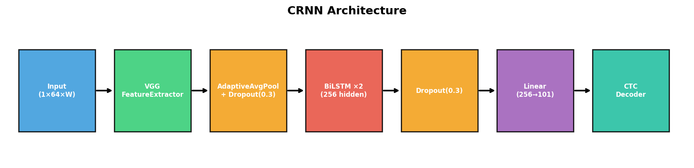
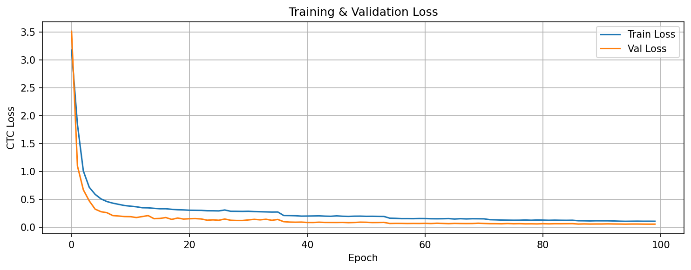
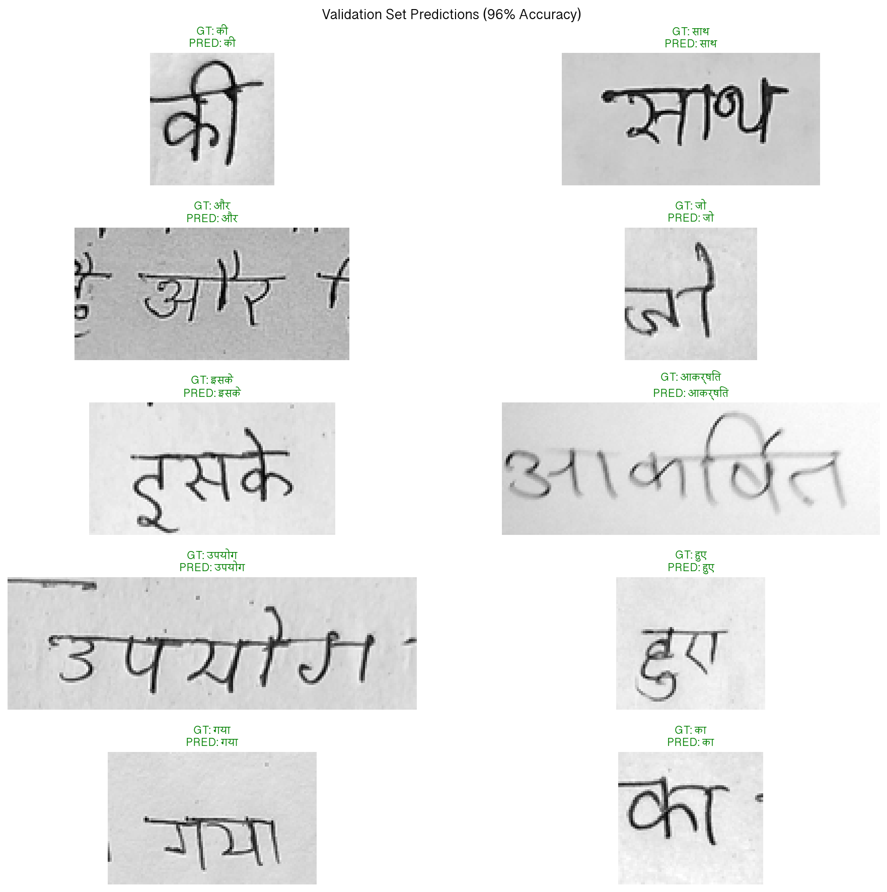
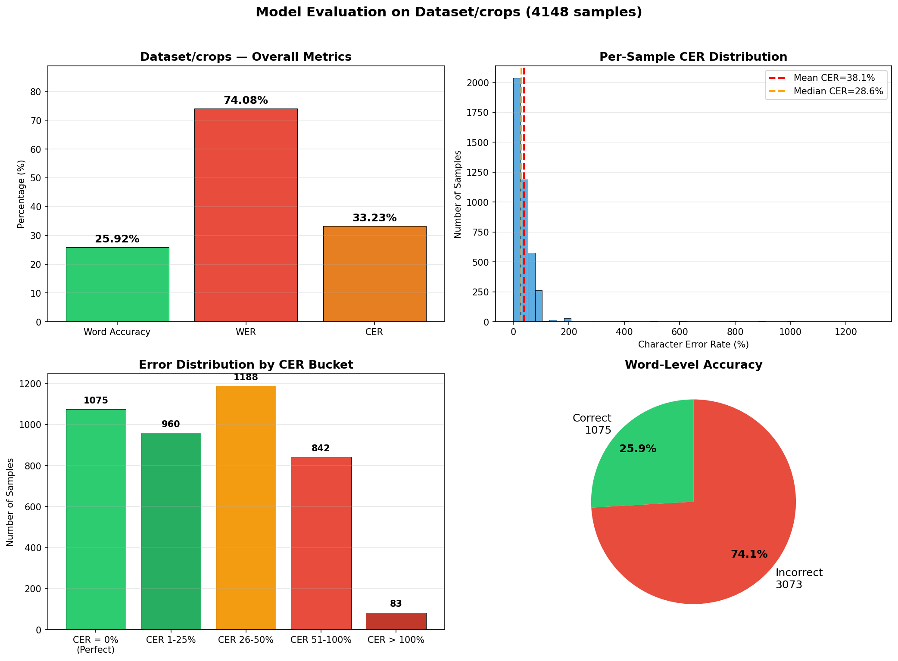
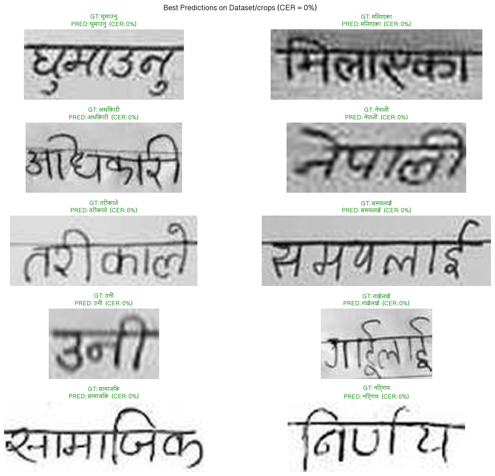
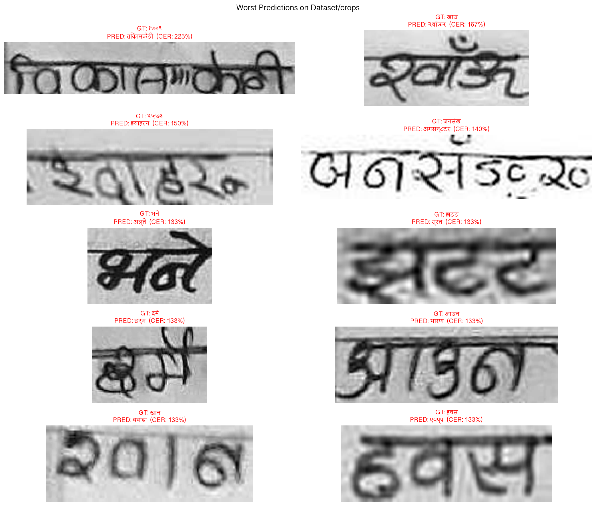

# Nepali Handwritten Text Recognition (HTR)

A CRNN-based pipeline for recognizing handwritten Nepali (Devanagari) text at the word level. I built this to tackle HTR for a low-resource language — most OCR tools don't work well on Nepali handwriting out of the box, so I trained my own model from scratch.



## What this does

Takes a cropped image of a handwritten Nepali word and predicts the text. This is the **second stage** of a two-stage pipeline:

1. **[YOLOv11 Word Detection](https://github.com/utsabfdahal/YoloFinetuned)** — detects and crops individual words from full document/page images
2. **This model (CRNN)** — reads each cropped word image → outputs Devanagari text

## Methodology

The full HTR system works as a two-stage pipeline:

### Stage 1: Word Detection with YOLOv11 → [`YoloFinetuned`](https://github.com/utsabfdahal/YoloFinetuned)

Before we can recognize handwritten text, we need to locate individual words in a document image. I fine-tuned a **YOLOv11** object detection model to detect word-level bounding boxes in scanned pages of Nepali handwriting. The YOLO model outputs crop coordinates for each detected word, which are then extracted as individual images.

This is the first step — the cropped word images produced by YOLO become the input to the recognition model in this repository.

### Stage 2: Word Recognition with CRNN → This Repository

Each cropped word image is fed into the **CRNN** (Convolutional Recurrent Neural Network) model defined here. The model extracts visual features using a VGG-style CNN, models the character sequence with a bidirectional LSTM, and decodes the output using CTC (Connectionist Temporal Classification). The result is the predicted Nepali text for each word.

```
┌─────────────────┐     ┌──────────────────┐     ┌──────────────────┐
│  Document Page   │ ──► │  YOLOv11 (Stage 1)│ ──► │  Cropped Words   │
│  (full scan)     │     │  Word Detection   │     │  (individual)    │
└─────────────────┘     └──────────────────┘     └────────┬─────────┘
                                                          │
                                                          ▼
                                                 ┌──────────────────┐
                                                 │  CRNN (Stage 2)  │
                                                 │  Text Recognition│
                                                 └────────┬─────────┘
                                                          │
                                                          ▼
                                                 ┌──────────────────┐
                                                 │  Predicted Text  │
                                                 │  (Devanagari)    │
                                                 └──────────────────┘
```

## Architecture

**VGG Feature Extractor → BiLSTM × 2 → CTC Decoder**

- VGG-style CNN (1 → 256 channels) extracts visual features
- Two stacked Bidirectional LSTMs (256 hidden units each) model the sequence
- CTC loss handles variable-length alignment without needing character-level bounding boxes
- Dropout (0.3) after CNN and LSTM layers to prevent overfitting
- Input: grayscale image resized to height 64, variable width (capped at 600px)
- Output: sequence of 101 classes (100 Nepali characters + CTC blank)

## Dataset

- **Training**: ~85,000 word-level samples from `Word_Level_Training_Set` (tab-separated `image_path → label`)
- **Validation**: 10% split (~8,500 samples)
- **Evaluation**: 4,148 independently-labelled YOLO-cropped samples from `Dataset/crops`
- **Test**: 20,511 unlabelled images from `Word_Level_Test_Set`
- **Character set**: 100 Devanagari characters including vowels, consonants, matras, digits, and punctuation

## Training Details

| Parameter | Value |
|-----------|-------|
| Optimizer | Adam (lr=1e-3, weight_decay=1e-4) |
| Batch size | 16 (gradient accumulation ×2 = effective 32) |
| LR schedule | ReduceLROnPlateau (factor=0.5, patience=5) |
| Early stopping | Patience 20 epochs |
| Device | Apple MPS (M-series GPU) |
| Augmentation | Random rotation (±3°), affine transforms, morphological erosion/dilation, Gaussian noise, color jitter |

CTC loss doesn't support MPS, so the loss computation runs on CPU while everything else stays on GPU.

## Results

### Validation Set (same distribution as training)

**96.00% word-level accuracy** — the model gets most words exactly right on data similar to what it was trained on.



Training converged around epoch 30–40 with best validation loss of 0.0523.



### Out-of-Distribution Evaluation (Dataset/crops)

These are YOLO-cropped word images from a completely different source — different handwriting styles, different image quality. This is the real test.

| Metric | Score |
|--------|-------|
| Word Accuracy | 25.92% (1,075 / 4,148) |
| Word Error Rate (WER) | 74.08% |
| Character Error Rate (CER) | 33.23% |



#### Why the large performance gap?

The 96% → 26% accuracy drop comes down to two main factors:

1. **Training data is Indian Devanagari, evaluation data is Nepali handwriting.** The training set (`Word_Level_Training_Set`) consists of Indian handwriting samples. While both use the Devanagari script, Nepali handwriting has different stylistic patterns — different stroke habits, letter forms, and conjunct preferences. The model learned Indian writing conventions well (hence 96% on the held-out validation split from the same source), but those patterns don't transfer cleanly to Nepali handwriting.

2. **Poor image quality in the evaluation set.** As visible in the worst predictions below, many of the `Dataset/crops` images are heavily degraded — blurry, low contrast, noisy, and sometimes containing multiple words or partial words in a single crop. The model was never exposed to this level of degradation during training, so it hallucinates entirely wrong character sequences (CER values exceeding 100% in the worst cases, meaning the predictions are longer and completely different from the ground truth).

The CER of 33% is still somewhat encouraging — even across this domain gap, the model gets roughly two-thirds of characters right on average. But the word-level accuracy suffers because even a single wrong character means the whole word is counted as incorrect.

### Best & Worst Predictions

Here are samples where the model did well (perfect character match):



And the hardest cases — these illustrate both problems: the handwriting style is distinctly Nepali (not what the model was trained on), and the image quality is poor with blurry strokes, low contrast, and noisy crops that sometimes capture more than one word:



## Project Structure

```
├── nepali_htr_train.ipynb      # Main training notebook (everything)
├── exported_model/
│   ├── config.yaml             # Model config (imgH, channels, hidden size)
│   ├── nepali_char.txt         # 100-character Devanagari charset
│   └── nepali_crnn_best.pth    # Trained weights (not in repo)
├── EasyOCR/                    # EasyOCR framework (for reference/export)
│   ├── easyocr/                # Core library
│   └── trainer/                # Training scripts
├── Dataset/
│   ├── labels.csv              # Ground truth labels
│   └── crops/                  # YOLO-cropped word images (not in repo)
├── Word_Level_Training_Set/    # 85K training images (not in repo)
├── Word_Level_Test_Set/        # 20K test images (not in repo)
└── assets/                     # README screenshots
```

## How to use

### Prerequisites

```bash
python -m venv .venv
source .venv/bin/activate
pip install torch torchvision pillow matplotlib numpy
```

### Training

Open `nepali_htr_train.ipynb` and run all cells. You'll need the `Word_Level_Training_Set` directory with the training data.

### Inference on a single image

```python
import torch
from PIL import Image
from torchvision import transforms

# Load model (see notebook for CRNN class definition)
model = CRNN()
model.load_state_dict(torch.load('exported_model/nepali_crnn_best.pth', map_location='cpu'))
model.eval()

# Preprocess
transform = transforms.Compose([
    ResizeKeepAspectRatio(64),
    transforms.ToTensor(),
    transforms.Normalize((0.5,), (0.5,)),
])

img = Image.open('path/to/word_image.png').convert('L')
img_t = transform(img).unsqueeze(0)

with torch.no_grad():
    pred = model(img_t)
    text = greedy_decoder(pred)[0]

print(text)
```

## Things I learned

- **CTC loss on Apple MPS is not supported** — spent a while debugging before realizing I just needed to move the tensors to CPU for the loss computation
- **Padding value matters** — using 0.0 (black padding) confused the model since the background is white. Switching to 1.0 (white) made a big difference
- **Label quality is everything** — found 281 samples in the evaluation set with trivial labels like "-" for images containing full words. Had to filter those out for meaningful worst-case analysis
- **96% on validation doesn't mean 96% in the real world** — the drop to ~26% on out-of-distribution data shows the model learned the training distribution well but needs more diverse training data to generalize

## What's next

- [ ] Fine-tune on the Dataset/crops samples to improve out-of-distribution performance
- [ ] Try attention-based decoder (TrOCR-style) instead of CTC
- [ ] Add more diverse handwriting samples to training data
- [ ] Export to EasyOCR-compatible format for easy inference
- [ ] Experiment with synthetic data generation for Nepali text

## Built with

- PyTorch
- EasyOCR (architecture reference)
- PIL / torchvision
- Matplotlib (with Devanagari font support via `Devanagari Sangam MN`)
