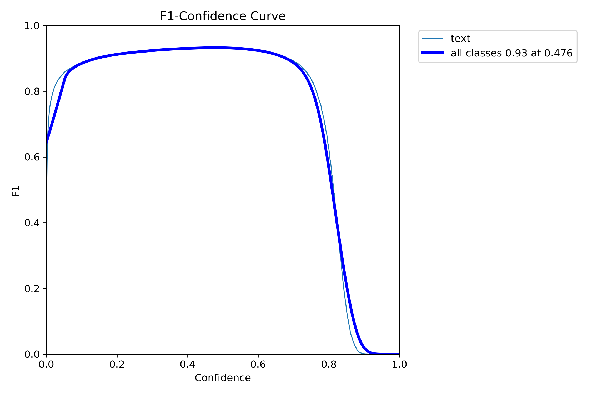
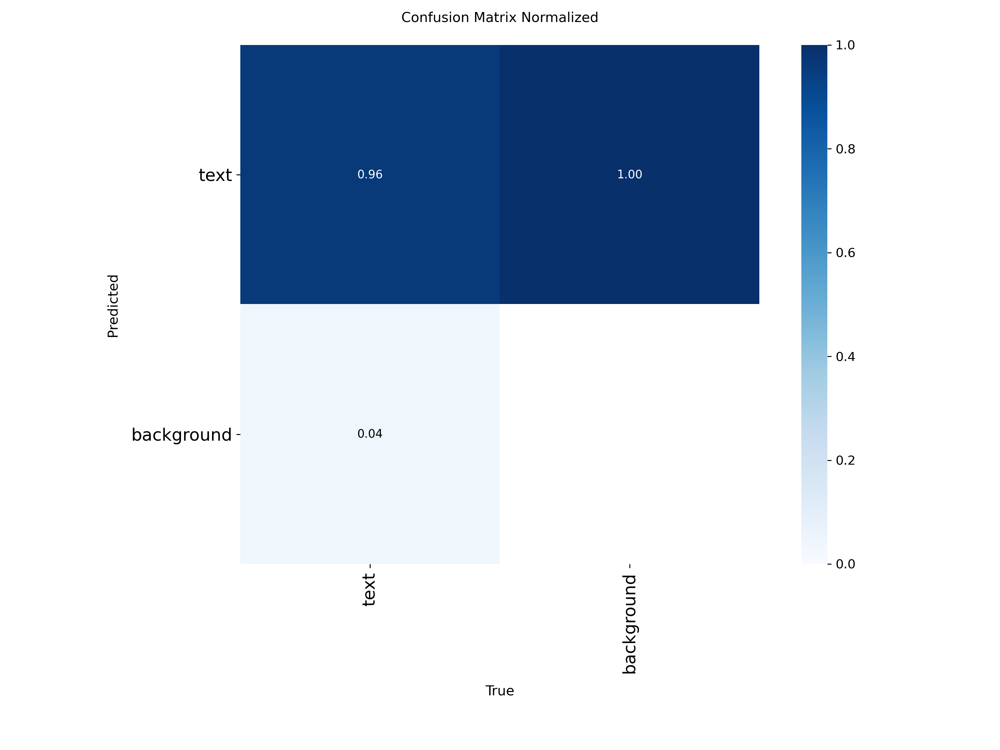

# Nepali Handwritten Text Detection — YOLOv11n Fine-tuned

A fine-tuned **YOLOv11n** (nano) model trained to detect handwritten Nepali text regions in document images. This was built as part of a larger Nepali HTR (Handwritten Text Recognition) pipeline — the idea is to first *find* where the text is, then pass those crops to an OCR model for recognition.

---

## Why This Exists

Most OCR systems assume you already have a clean, cropped text image. In practice, you're working with full-page scans, photos of notebooks, or government forms — and the text could be anywhere. This model handles that first step: **locating handwritten text regions** so downstream recognition can focus on what matters.

---

## Dataset

The model was trained on the [Nepali Handwritten Images for Text Detection](https://www.kaggle.com/datasets/sweekardahal/nepali-handwritten-images-for-text-detection) dataset from Kaggle. The original annotations are in Pascal VOC (XML) format and were converted to YOLO format during preprocessing.

| Split | Images |
|-------|--------|
| Train | ~80%   |
| Val   | ~20%   |
| Test  | Separate test set from the dataset |

**Class:** Single class — `text`

The preprocessing notebook (`preprocess.ipynb`) handles everything: downloading the dataset from Kaggle, converting VOC bounding boxes to YOLO format (normalized `x_center, y_center, width, height`), splitting train into train/val (80/20, seed 42), and generating the `data.yaml` config.

---

## Training Setup

| Parameter     | Value           |
|---------------|-----------------|
| Base Model    | `yolo11n.pt` (pretrained on COCO) |
| Image Size    | 640 × 640       |
| Batch Size    | 16              |
| Epochs        | 100             |
| Early Stopping| Patience = 20   |
| Framework     | [Ultralytics](https://github.com/ultralytics/ultralytics) |
| Platform      | Lightning AI Studio |

Training was straightforward — load the pretrained nano model, point it at the dataset, and let it run. The full training notebook is in `yolo11n.ipynb`.

---

## Results

After 100 epochs, the model converged nicely. Here's where it ended up:

### Final Metrics (Epoch 100)

| Metric             | Value    |
|--------------------|----------|
| **Precision**      | 0.9349   |
| **Recall**         | 0.9307   |
| **mAP@50**         | 0.9657   |
| **mAP@50-95**      | 0.6669   |
| **Box Loss (val)** | 1.065    |
| **Cls Loss (val)** | 0.508    |

The model hits **96.6% mAP@50** — it finds nearly all the text regions and draws tight boxes around them. The mAP@50-95 of 66.7% is decent for a nano model on handwritten content, where text regions can be irregular and hard to box perfectly.

### F1-Confidence Curve



Peak F1 score of **0.93** at a confidence threshold of **0.476**. The curve stays high across a wide range of thresholds (roughly 0.1 to 0.7), which means the model is fairly robust — you don't have to be super precise with your confidence cutoff to get good results.

### Confusion Matrix



- **96% of actual text** is correctly detected (true positive rate)
- Only **4% of text** is missed (leaked to background)
- Almost no false positives from background — the model isn't hallucinating text where there isn't any

### Training Progression

The model improved steadily over 100 epochs. Some highlights from the training log:

| Epoch | Precision | Recall | mAP@50 | mAP@50-95 |
|-------|-----------|--------|--------|-----------|
| 1     | 0.192     | 0.669  | 0.199  | 0.078     |
| 10    | 0.890     | 0.892  | 0.918  | 0.600     |
| 25    | 0.899     | 0.902  | 0.936  | 0.615     |
| 50    | 0.910     | 0.922  | 0.945  | 0.643     |
| 75    | 0.917     | 0.931  | 0.958  | 0.656     |
| 100   | 0.935     | 0.931  | 0.966  | 0.667     |

Most of the learning happened in the first 10 epochs (going from ~20% to ~92% mAP@50). The remaining 90 epochs were about squeezing out that last 5% and getting the boxes tighter.

---

## Project Structure

```
YoloFinetuned/
├── preprocess.ipynb              # Data download, VOC→YOLO conversion, splits
├── yolo11n.ipynb                 # Model training, validation, inference
├── nepali_hrt_yolo11n/
│   ├── weights/
│   │   └── best.pt              # Best model checkpoint (use this for inference)
│   ├── results.csv              # Per-epoch training metrics
│   ├── BoxF1_curve.png          # F1 vs confidence threshold plot
│   └── confusion_matrix_normalized.png
└── README.md
```

---

## Quick Start

### Inference with the trained model

```python
from ultralytics import YOLO

# Load the fine-tuned model
model = YOLO("nepali_hrt_yolo11n/weights/best.pt")

# Run detection on an image
results = model.predict(
    source="path/to/your/image.jpg",
    conf=0.4,       # confidence threshold
    save=True,      # save annotated image
    save_txt=True,  # save detection results as .txt
)

# Access detections
for box in results[0].boxes:
    print(f"Confidence: {box.conf[0]:.2f}, BBox: {box.xyxy[0].tolist()}")
```

### Retrain from scratch

```python
from ultralytics import YOLO

model = YOLO("yolo11n.pt")
model.train(
    data="path/to/data.yaml",
    epochs=100,
    imgsz=640,
    batch=16,
    patience=20,
    name="nepali_htr_yolo11n",
)
```

---

## Requirements

```
ultralytics
pyyaml
kagglehub  # only needed for dataset download
```

---

## What's Next

This model gives you bounding boxes around text regions. The natural next step is to crop those regions and feed them into an OCR model (like EasyOCR or a custom CRNN) for actual character recognition. That's what the broader NepaliHTR pipeline does.

---

## Acknowledgments

- **Dataset:** [Sweekardahal/nepali-handwritten-images-for-text-detection](https://www.kaggle.com/datasets/sweekardahal/nepali-handwritten-images-for-text-detection) on Kaggle
- **Model:** [Ultralytics YOLOv11](https://github.com/ultralytics/ultralytics)
- **Training infra:** Lightning AI Studio
